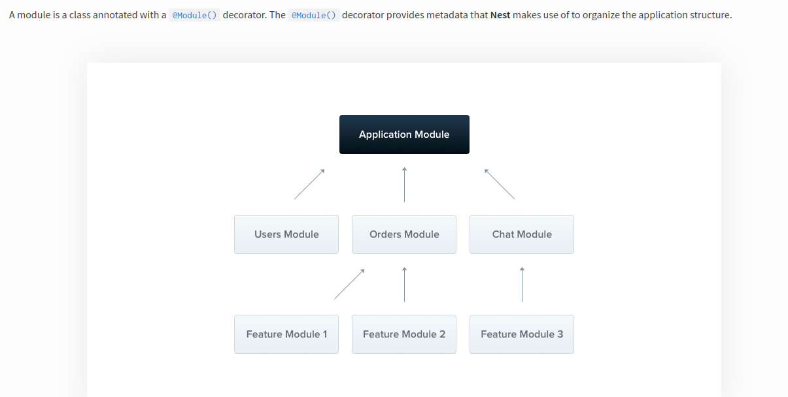
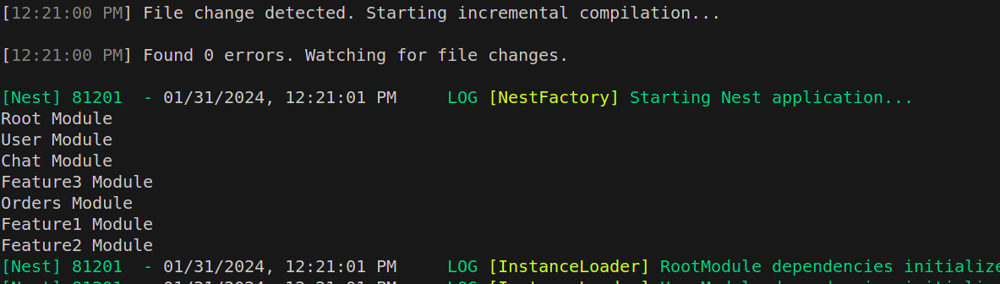
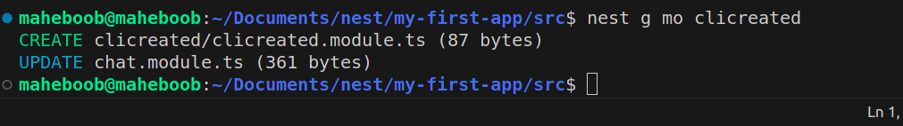
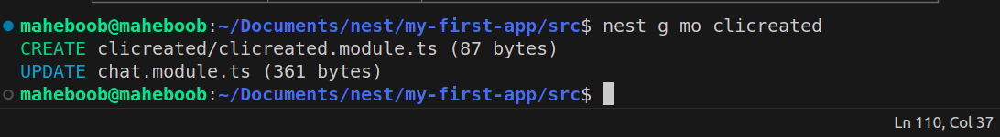
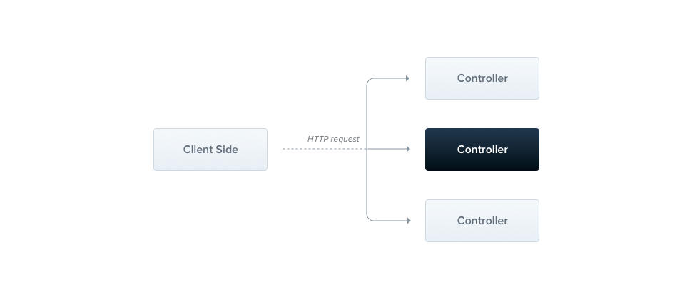
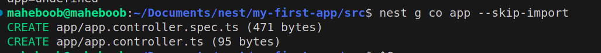
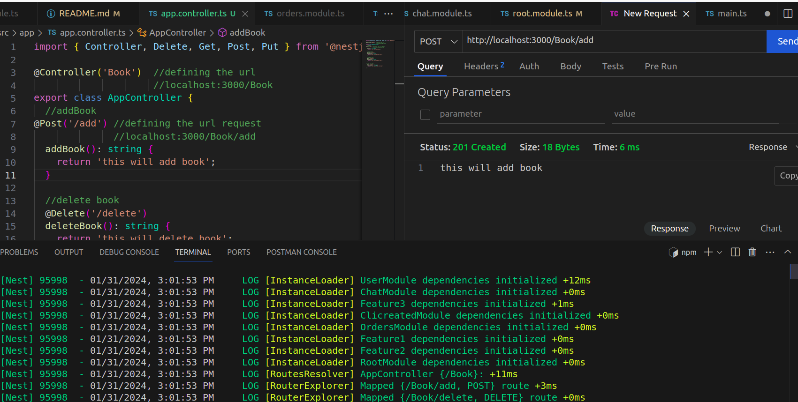
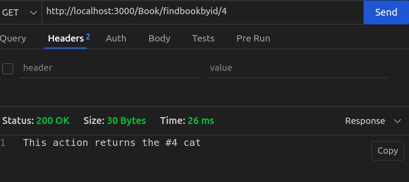
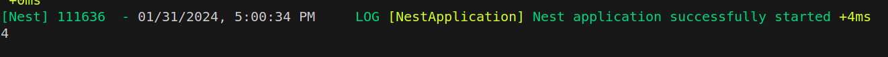

<p align="center">
  <a href="http://nestjs.com/" target="blank"></a>
</p>

[circleci-image]: https://img.shields.io/circleci/build/github/nestjs/nest/master?token=abc123def456
[circleci-url]: https://circleci.com/gh/nestjs/nest

  <p align="center">A progressive <a href="http://nodejs.org" target="_blank">Node.js</a> framework for building efficient and scalable server-side applications.</p>
    <p align="center">
<a href="https://www.npmjs.com/~nestjscore" target="_blank"></a>
<a href="https://www.npmjs.com/~nestjscore" target="_blank"></a>
<a href="https://www.npmjs.com/~nestjscore" target="_blank"></a>
<a href="https://circleci.com/gh/nestjs/nest" target="_blank"></a>
<a href="https://coveralls.io/github/nestjs/nest?branch=master" target="_blank"></a>
<a href="https://discord.gg/G7Qnnhy" target="_blank"></a>
<a href="https://opencollective.com/nest#backer" target="_blank"></a>
<a href="https://opencollective.com/nest#sponsor" target="_blank"></a>
  <a href="https://paypal.me/kamilmysliwiec" target="_blank"></a>
    <a href="https://opencollective.com/nest#sponsor"  target="_blank"></a>
  <a href="https://twitter.com/nestframework" target="_blank"></a>
</p>
  <!--[](https://opencollective.com/nest#backer)
  [](https://opencollective.com/nest#sponsor)-->

## Description

[Nest](https://github.com/nestjs/nest) framework TypeScript starter repository.

## Installation

```bash
$ npm install
```

## Running the app

```bash
# development
$ npm run start

# watch mode
$ npm run start:dev

# production mode
$ npm run start:prod
```
## Modules

we will use watch mode 

```
npm run start:dev
```


```
following the structure just firstly maintain root.module.ts and main.ts check for the imports in the main.ts 
```

Than add a constructor to the export class root module to console.log 

now check the terminal u will se 
RootModule


similary make three files
``` 
touch user.module.ts orders.module.ts chat.module.ts
```

and than change the constructor's console.log and other namee declaration accordingly 

so we are basically following this structure. 


now enter in the code of root.module.ts under import and pass the three module as array 
  imports: [UserModule , ChatModule, OrdersModule],


now check the terminal u will se 
RootModule
UserModule
ChatModule
OrdersModule 


after this follow the architecture diagram
and make three files of Feature1,2,3
``` 
touch feature1.module.ts feature2.module.ts feature3.module.ts
```

and import this module accordingly in to the orders.module.ts and chat.module.ts

you will get this output finally 



* NOTE since we are manually creating the modules file so to solve this we have nest commands just type nest --help

so to create files from cli use
```
nest g mo clicreated
```

where g stands for generate and mo stands for module 

* so this will automatctly create a folder (clicreated) and a file called clicreate.module.ts
and will import it in root.module.ts
in my case it got imprtd in chat.module.ts
because bydefaul nest looks for the nearest module
 but if you creating a project from scratch and thers just root module it will go under root.module.ts

 also you can solve this by simply using
 ```
nest g mod nameofmod --module root

 ```



like this 


## CONTROLLERs



since if we run 

nest g co app

it will update it in nearest module so to avoid id we will user 

 nest g co app --skip-import
 
 
 and than will manually write the import code in root.module.ts and pass it under controller array


After creating the AppController class under app.controller.ts than write the APIs,

and than test if its working or not 
here is the output:


you can use @Redirect under get 
```
 @Get('/findall')
  @Redirect("https://www.linkedin.com/in/maheboob-patel/")
  findAllBook(): string {
    return 'this will Find all book';
  }

  ```

@Params to parameterized api call

```
  @Get('/findbookbyid/:bookid')
findbookbyid(@Param() custobj: any): string { 
    // here @Param is a builtin function custobj is the object and any is the type
    //@Params is the  decorator used to extract route parameters from the URL.
    // custobj its the parameter/variable that will hold the extracted value
  
  console.log(custobj.bookid);
  return `This action returns the #${custobj.bookid} cat`;
}
```



## Providers -- Service

refer to the cat folder and servcontrol for this concept

Okay just because we cant load many function in one controller which will make the controller file messy and hard to debug we use providers , for code separation and making the project more modular so basically we are just making the functions in cat.service.ts and calling them in the controller file via making a constructor which refers to service in controller 

so inshort we defined the routes endpoints under controller ( like in route.js if it was a MERN) and the actual action performing function under service.ts file (like in controler.js in MERN)


* NOTE : mention the service inside root.module.ts under providers
Nest is [MIT licensed](LICENSE).
